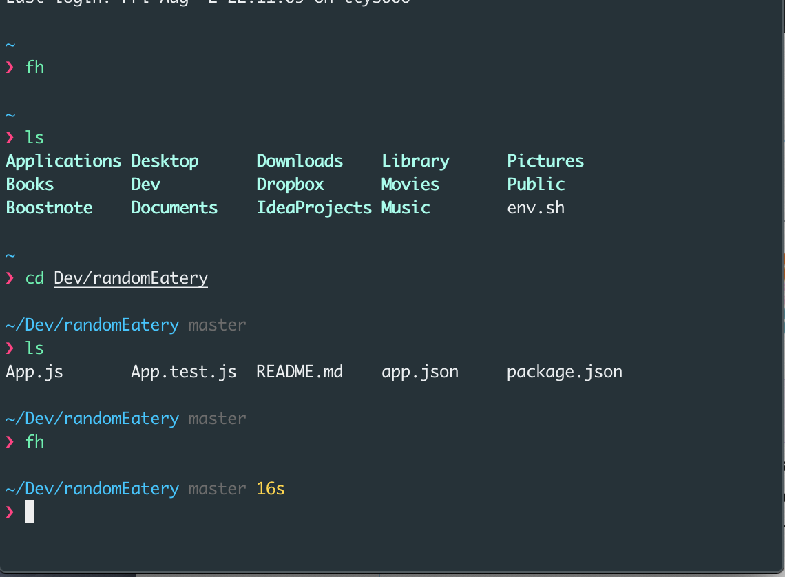

# Gigi's Dotfiles

Recently I decided to wipe my machook and set it up with only the tools i need and use often.
I have had to do this quite a few times and it got too repetative for my taste, and also got a little inspiration to work on this from one of my current favorite podcast [Developer Tea](https://spec.fm/podcasts/developer-tea) by [Jonathan Cutrell](https://twitter.com/jcutrell).

Feel free to use this repo as your baseline for your own dotfiles

## things installed
* google chrom
* VS Code
* iTerm2
* boostnote
* java
* dropbox
* alfred
* intellij
* nvm
* zsh syntax highlighting
* fuzzy find
* Bash completion

## My Terminal


### Usage
```
chmod +x install.sh
./install.sh
```

### Resources used
[Sourabh MacOS Setup](https://sourabhbajaj.com/mac-setup/)
[Marvin J. Cortés dotfiles](https://github.com/mcortes19/dotfiles)
[iterm2 material design](https://github.com/MartinSeeler/iterm2-material-design) by [Martin Steeler](https://github.com/MartinSeeler)
[pure prompt](https://github.com/sindresorhus/pure) by [Sindre Sorhus](https://github.com/sindresorhus)